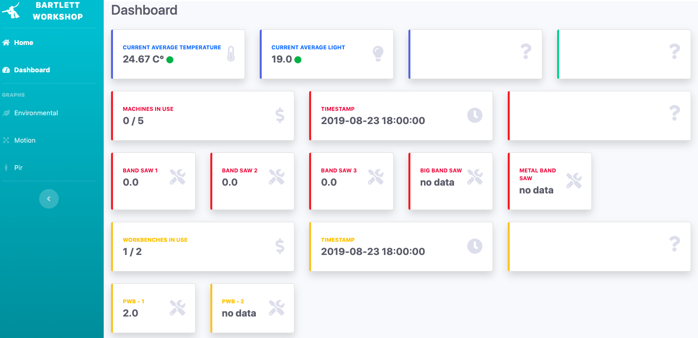
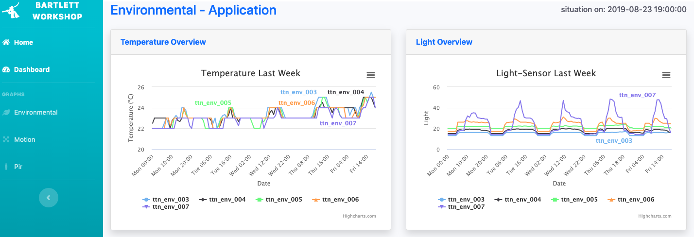
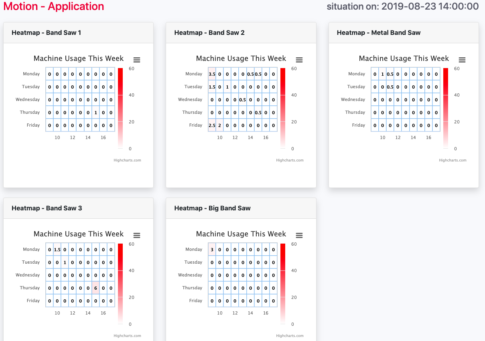
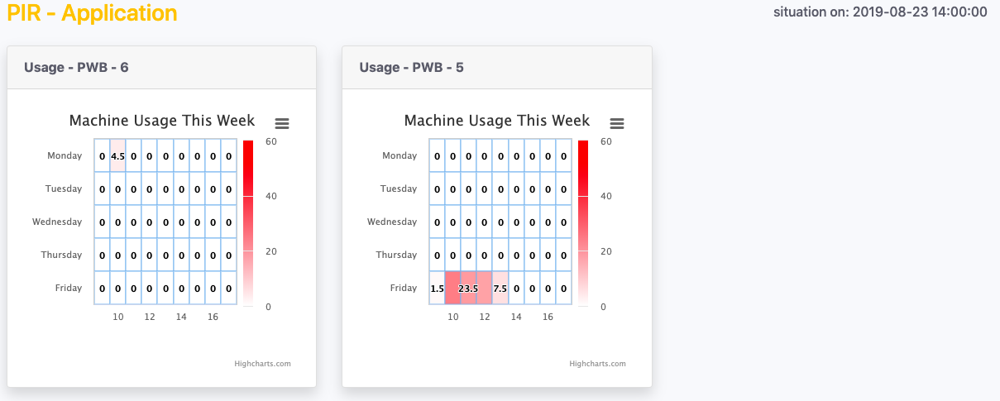

# Master Disseration Arthur Maenhout

add general information about the project

## Arduino - Files
The arduino file are created for three different applications

## Python - Files

## Python Flask Web App
When downloading the python flask folder on your local machine

Dashboard: 

Graphs - Environmental: 

Graphs - Motion: 

Graphs - Pir: 

