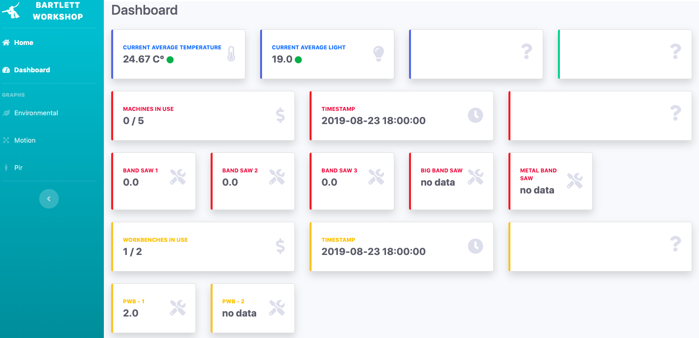
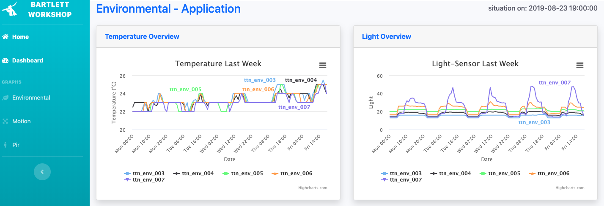
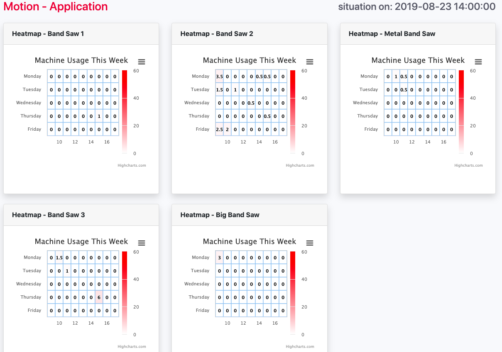
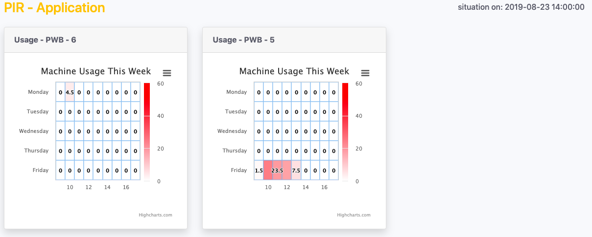

# Master Disseration Arthur Maenhout
Our world is becoming overwhelmed by billions of internet-connected devices, an evolution that will grow even more in the upcoming years. By 2020, 50 billion Internet of Things (IoT) objects will connect to the Internet and each other. With this upcoming trend, new technologies are emerging this on hardware, software and communication sides. This dissertation researches what open source technologies are available to develop an IoT system architecture that is inexpensive yet reliable. Besides, this system is implemented within a workshop to investigate if based on the gathered data it can optimise the space usage. Numerous IoT projects have been conducted in all sectors, this by companies and individuals they use either expensive complete IoT systems or developing new systems that are built for a particular project. I argue that we need to combine the knowledge that is developed in new open source technologies with Industry 4.0 devices and spaces to create an overall working system. Based on the literature review and trial and error, a low-cost IoT system architecture is developed. As the system architecture was successfully developed, it got implemented within the workshop. Analysis of the captured data demonstrated that the system was working as it was hoped for. On this basis, this system can be replicated in both industry IoT projects as individual projects. Further research will be needed to identify the optimal sensors to track space usage and so be able to optimise this usage

## Getting Started
These instructions will get you a copy of the project up and running using The Things Network microcontrollers and gateway, a Raspberry Pi and a cloud AWS database.

### Prerequisites
The things you will need to buy and install inorder to make use of the system are:

1. Create a Things Network Account and Application
    * [Account](https://www.thethingsnetwork.org/)
    * [Application](https://www.thethingsnetwork.org/docs/applications/add.html)
2. Get a Things Network microcontroller:
    * [Node](https://www.thethingsnetwork.org/docs/devices/node/)
    * [Uno](https://www.thethingsnetwork.org/docs/devices/uno/)
3. Look if there is an LoRaWAN Gateway nearby, if not, you will have to buy one and install it. 
    * [Gateway's](https://www.thethingsnetwork.org/)
4. Install Arduino IDE
    * [Arduino](https://www.arduino.cc/en/main/software)
5. Add the Things Network microcontrollers to the application:
    * [Register Microcontroller](https://www.thethingsnetwork.org/docs/devices/registration.html)
5. Get a Raspberry Pi Model 3+ B
    * [Raspberry Pi](https://www.amazon.co.uk/Raspberry-Model-Official-Essentials-BLACK/dp/B07BFVYMJY/ref=asc_df_B07BFVYMJY/?tag=googshopuk-21&linkCode=df0&hvadid=310818960639&hvpos=1o1&hvnetw=g&hvrand=17775324292465302501&hvpone=&hvptwo=&hvqmt=&hvdev=c&hvdvcmdl=&hvlocint=&hvlocphy=1006886&hvtargid=pla-436476818288&psc=1)
6. Create an account on AWS
    * [AWS Free Tier](https://aws.amazon.com/free/)


### Installing 
The next thing in this project is to install the different hardware and software. 

#### Arduino
The first software that is needed in this projects is the Arduino IDE. This open source software makes it possible to control the microcontrollers. To make use of The Things Network microcontrollers, the following libraries need to be installed: 

* [Uno](https://github.com/TheThingsNetwork/arduino-device-lib)
* [Node](https://github.com/TheThingsNetwork/arduino-node-lib)

#### Microcontrollers
After, in the Arduino folder, the are three different applications:

The **environmental** application which captures the most basic information the node can give; temperature, light level and the battery level of the node. The **Motion** application, that captures the movement of the Nodes. The **PIR** application that is build of on TTN Uno will connect with a PIR sensor.

Each of the Arduino scripts can be uploaded to the particular boards. After the microcontrollers will send the information to The Things Network applications.

#### Raspberry Pi
The Raspberry Pi is being used as data processor, to install the device the following points need to be done.

##### configuration
Add a password, a wifi connection and enable SSH connections
````bash
sudo raspi−config
````
##### remote it
Since it is handy to be able to connect to the Raspberry Pi from a distance, install Remote.It. After creating an account on their website the following code will get you to the set up menu. Next, you will be able to log in to the website, get your login codes and connect to the Raspberry Pi from everywhere.
````bash
sudo apt−get install connectd
sudo connectd installer
````

##### Mariadb
In order to store the captured data, create a MariaDB database on the raspberry Pi
````bash
#install mysql server
sudo apt−get install mysql−server 
sudo mysql secure installation

#login to root
sudo mysql −u root−p

#create new database
CREATE DATABASE "add_database_name";
#add user with all privileges
CREATE USER "add_user_name"@localhost IDENTIFIED BY "add_password";
GRANT ALL PRIVILEGES ON "add_database_name".* TO "add_user_name"@localhost;
#change database
USE "add_database_name";
#create table
CREATE TABLE "add_table_name" (id INT AUTO_INCREMENT PRIMARY KEY, dev_id VARCHAR(255), payload_fields TEXT, time DATETIME);

#exit mysql server
exit
````

#### AWS
As we also want to have a cloud database that store our data, make use of the AWS free tier. Here, create an RDS database with the necessary tables. 

## Python - Files - ttn2mysql
The most crucial script are created in python, wihtin the Python/ttn2mysql folder the different files are accessable.


## Python Flask
After the creation of all these tables, some [API endpoints](API/README.MD) are created for this projects. 

Also a webframe work is developed by running the python flask app. The follwing images show the end results of this flask app. 

These endpoints and webpages will only work if you download the python flask files and start the falsk app, using the terminal. 


Dashboard: 


Graphs - Environmental: 


Graphs - Motion: 


Graphs - Pir: 

